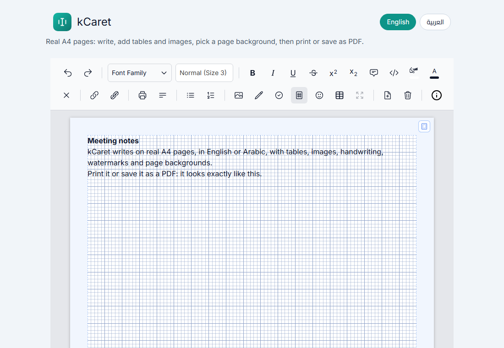

<p align="center"></p>

<h1 align="center">kCaret</h1>

<p align="center">A rich-text editor for the web that works page by page, like a word processor:<br>
real A4 sheets with margins and page numbers, Arabic and English, tables, images, handwriting,<br>
watermarks, page backgrounds, print and PDF. One JavaScript file, no framework.</p>

<p align="center"></p>

## Features

- **Real A4 pages**: content flows from page to page, with per-page margins and `1 / N` page numbers.
- **Arabic and English**: right-to-left and left-to-right, with the interface in either language.
- **Formatting**: fonts and sizes, bold, italic, underline, strike, superscript, subscript, colours, highlight, alignment, lists, quotes.
- **Tables**: insert, add or remove rows and columns, resize.
- **Images**: upload, resize, rotate, float and align, with captions.
- **Code**: inline code and code blocks with syntax colours.
- **Handwriting**: draw with a pen, highlighter or eraser right on the page.
- **Watermark**: a diagonal text on every page.
- **Page background**: plain, dotted, squares, graph or music paper, in four line colours.
- **Print and PDF**: what you see is what prints, with margins, page numbers, watermark and background. You can also save a page as a PNG.
- **Undo and redo**, emoji, links (unsafe `javascript:` / `data:` links never run), and optional auto-save in the browser.

## Quick start

kCaret needs **Tailwind CSS v2** utility classes for its toolbar and panels. A copy is included in `vendor/`.

```html
<link href="vendor/tailwind.min.css" rel="stylesheet">
<link href="dist/kCaret.css" rel="stylesheet">
<script src="dist/kCaret.js"></script>

<div id="editor-container"></div>

<script>
  const editor = new kCaret('#editor-container', {
    language: 'en',          // 'en' or 'ar'
    width: '880px',
    height: '400px',
    heightMode: 'min',       // 'min' grows with the text, 'fixed' scrolls
    useLocalStorage: true,   // keep the document after a reload
    borderRadius: '10px',
    pageBackground: 'none'   // 'none' | 'dotted' | 'squares' | 'graph' | 'music'
  });
</script>
```

Open [`demo/index.html`](demo/index.html) in a browser to try it (add `?lang=ar` for Arabic). No server or build step is needed.

The font list offers Google Fonts (Amiri, Cairo, Tajawal, Caveat…). Load them as in the demo's `<head>` to use them; otherwise the browser falls back to a similar font.

## Options

| Option | Default | Description |
|---|---|---|
| `language` | `'en'` | Interface language and writing direction: `'en'` or `'ar'`. |
| `width` | `'880px'` | Maximum width of the editor. |
| `height` | `'400px'` | Height of the writing area. |
| `heightMode` | `'fixed'` | `'min'`: grows with the content. `'fixed'`: keeps its height and scrolls. |
| `useLocalStorage` | `false` | Saves the document, margins, watermark and page background in the browser. |
| `borderRadius` | `'0'` | Corner radius of the editor box. |
| `showPageBreaks` | `true` | Draws the A4 sheets, margins and page numbers. |
| `margins` | `{top: 10, bottom: 10, left: 10, right: 10}` | Default page margins, in millimetres. |
| `pageNumberInset` | `15` | Distance of the page number from the right edge of the sheet, in mm. |
| `pageBackground` | `'none'` | `'none'`, `'dotted'`, `'squares'`, `'graph'` or `'music'`. |
| `pageBackgroundColor` | `'#8ea2c8'` | Line colour of the background, as `#rrggbb`. |

## Methods

```js
editor.getCleanHTML();                         // the document's HTML, ready to save
editor.editor;                                 // the editable element itself

editor.setPageBackground('graph', '#7fb69a');  // style and (optional) line colour
editor.setPageMargins(0, { top: 25, bottom: 25, left: 20, right: 20 });   // page 1, in mm
editor.setPageNumberInset(20);                 // mm from the right edge
editor.addPage();                              // a new blank page at the end

editor.printAsPDF();                           // print dialog: print or save as PDF
editor.downloadPageAsPNG(0);                   // page 1 as a PNG image
editor.performClearAll();                      // empty document (no watermark or background)
```

## Arabic hand font (optional)

The font list includes an Arabic handwriting entry named **Shekari**. Its font file is not included here, because its licence does not allow it to be shared. To use it, place a licensed `shekari.ttf` next to `kCaret.css` (the stylesheet loads it from there). Without it, that entry falls back to another font.

## Browser support

Current versions of Chrome, Edge, Firefox and Safari, on desktop and mobile.

## Licence

[MIT](LICENSE). Tailwind CSS (in `vendor/`) is © Tailwind Labs, also under the MIT licence.

---

<p align="center">Made by <a href="https://akhdarkit.me">akhdarkit.me</a>. Try the live demo at <a href="https://akhdarkit.me/projects/kcaret/">akhdarkit.me/projects/kcaret</a>.</p>
